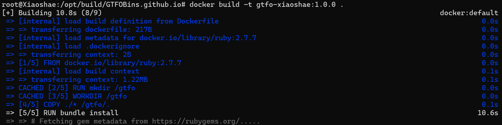

# ENGLISH

# GTFOBins

[](https://github.com/GTFOBins/GTFOBins.github.io/actions?query=workflow:CI)

GTFOBins is a curated list of Unix binaries that can be used to bypass local security restrictions in misconfigured systems.

Find the project at https://gtfobins.github.io


# 中文

# GTFOBins

[](https://github.com/GTFOBins/GTFOBins.github.io/actions?query=workflow:CI)

GTFOBins 是 Unix 二进制文件的精选列表，可用于绕过配置错误的系统中的本地安全限制。

找到该项目：https://gtfobins.github.io


---

注：以下内容为fork作者的介绍


该项目从gtfobins项目分叉而来，为该项目添加了Dockerfile方便使用docker容器一键部署该项目。

Dockerfile

```dockerfile
FROM ruby:2.7.7

RUN mkdir /gtfo

WORKDIR /gtfo

COPY ./* /gtfo/.

RUN bundle install


ENV HOST "0.0.0.0"
ENV PORT 80

CMD bundle exec jekyll serve --host "$HOST" --port "$PORT"
```

- 默认**主机地址**：`"0.0.0.0"`
- 默认**主机端口**：`80`


使用方法：

```
docker build -t gtfo:1.0.0 .
```




制作好的镜像

```bash
root@Xiaoshae:/opt/build/GTFOBins.github.io# docker images
REPOSITORY        TAG       IMAGE ID       CREATED          SIZE
gtfo              1.0.0     587555c65bc8   20 minutes ago   1.06GB
```


启动容器

```html
docker run --name gtfo -itd -p 81:80 gtfo:1.0.0
```


启动容器，**指定容器内部**的**主机地址**和**主机端口**

```
docker run --name gtfo -itd -p 81:8080 -e HOST="127.0.0.1" -e PORT=8080 gtfo:1.0.0
```

- 主机地址：`-e HOST="127.0.0.1"`
- 主机端口：`-e PORT=80`


**fork作者**：小沙鳄Crocodile
